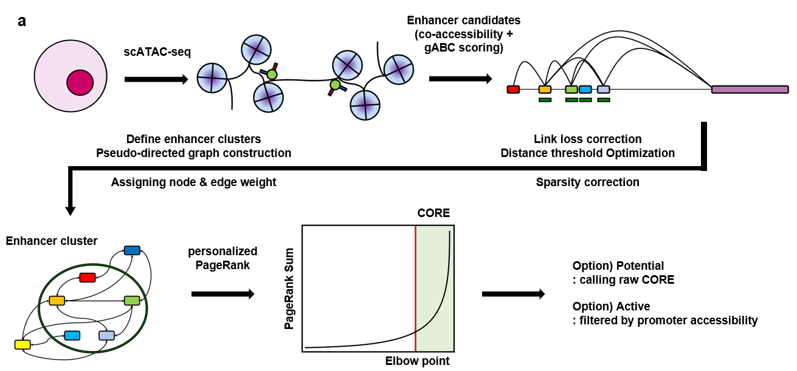

<p align="center">

</p>

# enCORE
**Enhancer-Enhancer Network-based Prediction of Clustered Open Regulatory Elements (CORE) using scATAC-seq data**

## Overview
enCORE is a computational framework for identifying highly interactive enhancer clusters from single-cell chromatin accessibility. enCORE uniquely defines such enhancer clusters as Clustered Open Regulatory Elements (CORE). enCORE operates solely on single-cell ATAC-seq data, without requiring matched single-cell RNA-seq data or multimodal measurements (e.g., 10X Multiome RNA/ATAC).

<p align="center">

</p>

## Installation
You can install the development version of enCORE from [GitHub](https://github.com/) with:

``` r
# install.packages("devtools")
devtools::install_github("R-Krait/enCORE")
```

## Requirements
The packages listed below are required dependencies for enCORE.

- `ArchR (>= 1.0.2)`
- `TxDb.Hsapiens.UCSC.hg38.knownGene (>= 3.16.0)`
- `TxDb.Hsapiens.UCSC.hg19.knownGene (>= 3.2.2)`
- `TxDb.Mmusculus.UCSC.mm10.knownGene (>= 3.10.0)`
- `org.Hs.eg.db (>= 3.16.0)`
- `org.Mm.eg.db (>= 3.16.0)`
- `GenomicRanges (>= 1.50.2)`
- `GenomicFeatures (>= 1.50.4)`
- `ChIPseeker (>= 1.34.1)`
- `data.table (>= 1.16.0)`
- `dplyr (>= 1.1.4)`
- `reshape2 (>= 1.4.4)`
- `AnnotationDbi (>= 1.60.2)`
- `progress (>= 1.2.2)`
- `igraph (>= 1.5.1)`
- `mefa4 (>= 0.3-9)`
- `parallel (>= 4.2.1)`
- `stringr (>= 1.5.1)`
- `coop (>= 0.6-3)`
- `chromVARmotifs (>= 0.2.0)`
- `motifmatchr (>= 1.20.0)`
- `kneedle (>= 1.0.0)`
- `scales (>= 1.3.0)`

The enCORE package also requires command-line tools, STARE & BEDTools.

First, please install mamba as fast alternative to conda for package installation.
```
conda install conda-forge::mamba
```

Then, install STARE & BEDTools.
```
mamba install -c conda-forge -c bioconda stare-abc bedtools
```

## Example Usage
Please refer to `vignettes/introduction.Rmd`. The following parts should be modified to match your own dataset.

1. `setwd("~/PSJ/enCORE_dev")`

   Replace this path with your own working directory.

2. `proj4 <- readRDS("~/PSJ/test_enCORE/Save-Proj_r4/Save-ArchR-Project.rds")`

   Replace this with your own ArchR object saved in `.rds` format. The object must have been generated after completing IterativeLSI, peak calling, and iterative overlap peak merging procedures.

3. `proj5$Clusters2 <- mapLabels(proj5$Sample, newLabels = remapClust, oldLabels = names(remapClust))`

   Add the annotation labels for which you want to extract CORE, such as disease status or cell type, to the cell metadata under the name `Clusters2`.

4. The `output_dir` argument in the functions `Extract_initial_enhancer_candidates`, `Calculate_gABC_score`, and `Distill_CORE_per_cluster`

   Specify the directory where the output files generated by each function will be saved. Since these functions do **not** automatically create directories, the path provided to `output_dir` must already exist.

5. The `organism` argument in `Extract_initial_enhancer_candidates`

   Only `"hg38"`, `"hg19"`, and `"mm10"` are supported.

6. The `n_col` argument in `Calculate_gABC_score`

   This argument has the same meaning as the `n_col` argument in STARE. It should be set to **[the number of annotation label classes in Clusters2 (e.g., the number of cell types) + 3].**

7. The `motifPWMs` argument in `addMotifAnnotations`

   Use `human_pwms_v2` from **chromVARmotifs** when the `organism` is `"hg38"` or `"hg19"`, and use `mouse_pwms_v2` when the `organism` is `"mm10"`.

8. The `list_cluster` argument in `Determine_TF_weight_threshold`

   Provide the annotation labels for which you want to extract CORE as a vector. You may use either all annotation labels (Clusters2) or only a subset of them.

   Except for special cases, such as the automatically calculated threshold is very small (e.g., because of extremely low cell-to-cell heterogeneity), we recommend using **all annotation labels**, as shown below.

   ``` r
   list_group <- sort(unique(as.character(proj6$Clusters2)))
   data_lump_enCORE <- Determine_TF_weight_threshold(proj_atac = proj6, data_lump_enCORE = data_lump_enCORE, list_cluster = list_group, use_default_thres = FALSE)
   ```

## Example Format
(...)

## Citing `enCORE`
If you use enCORE in your research, please cite using:

(...)
